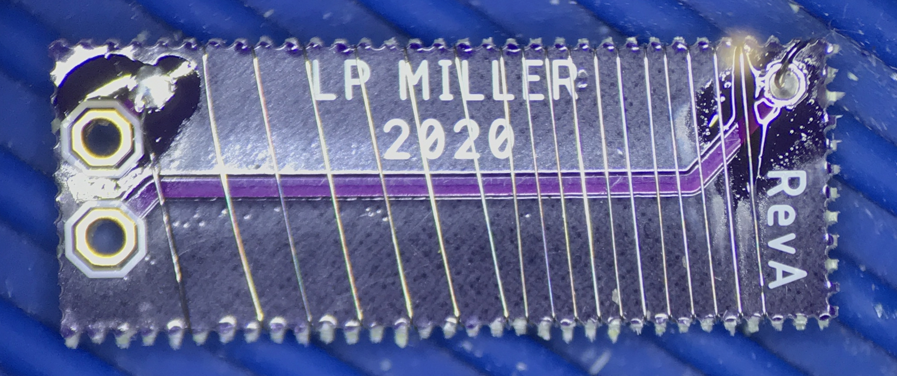
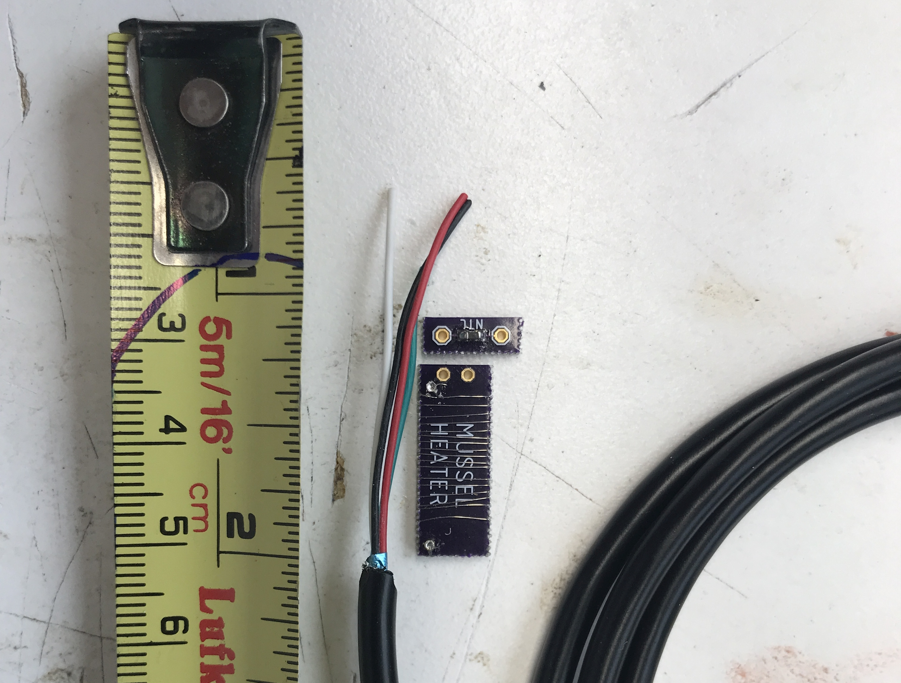

# MusselBedHeater_firmware
Luke Miller, 2020

 Firmware and hardware for Mussel Bed Heater project that Claire Windecker carried out 
 for her Masters thesis at Cal Poly Humboldt. The project consists of a circuit board 
 design that uses Arduino software to control an ATmega328P microcontroller to carry out 
 temperature monitoring and control heated artificial mussel beds. 
 

## Hardware design files 

Hardware_files/ contains parts lists, bill of materials, and Autocad Eagle design files. MusselBedHeater_RevG is the
most recent version, and contains all of the modifications made to the Revision F boards that were used 
in the field experiment. The heater sub-assembly board is in Heater_subassembly_revA.

## Arduino software files 

library_copies/ contains copies of the necessary Arduino libraries used to run the MusselBedHeater_firmware

Arduino programs used to run the hardware in the field are contained in:
* MusselBedHeater_6Crise/
* MusselBedHeater_field/

Utility Arduino programs used to set up the boards initially are in:
* serial_number_generator/
* settime_Serial/

## Heating assembly 

The heated artificial mussels were built using 38 Gauge Nichrome 80 wire (14 ohm per meter) in a 
length of 300 mm (~12 inches) wrapped around the Heater_subassembly_revA circuit board. This arrangement
should consume a maximum of about 3 Watts at 13V supply, but the circuit board is designed to pulse width
modulate the supply voltage to the heater and provide a basic PID control algorithm to achieve a desired 
target temperature above ambient. 

The cable supplying power to the heater coil also connected to a 6800 ohm 3% NTC thermistor, which was
used to measure the temperature of the artificial mussel. The thermistor was wired in a half-bridge
configured with 4700 ohm precision resistors found on the main MusselBedHeater_RevG circuit board.

The thermistor and heater coil board were eventually cast into the middle of an epoxy artificial mussel. 

One control board can control up to 16 heated mussels, including measuring their thermistor temperatures.

### Reference mussels

Part of the design included the need to have a reference temperature, which the heated mussels would then 
be heated above by 2C or 6C. Reference mussels used a MAX31820 OneWire temperature sensor, which was 
embedded in artificial epoxy mussels as well. One control board can monitor 4 reference temperature sensors. 
The software averages the temperatures from the available reference mussels and uses that value to establish
the 'ambient' mussel temperature. Heated mussels were then heated to a target temperature increase, 2 or 6 degrees
Celsius above ambient. 